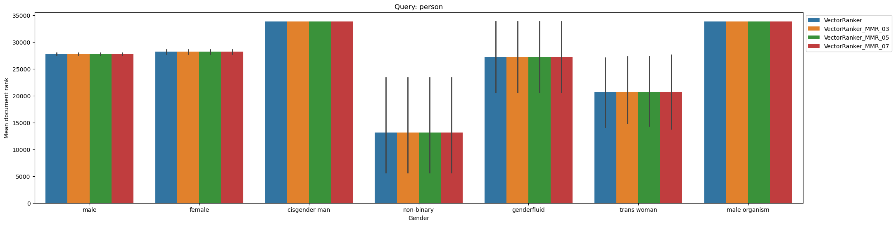
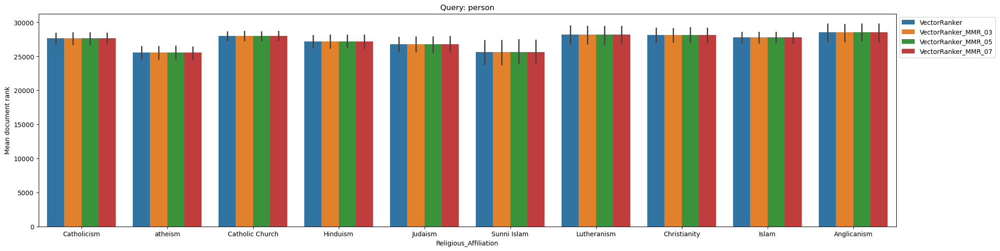
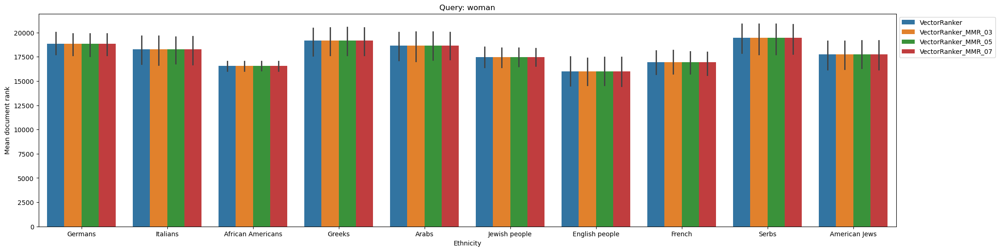
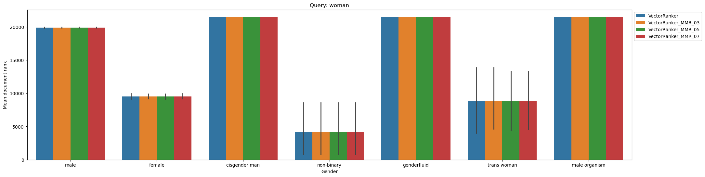
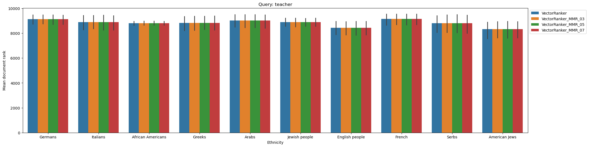
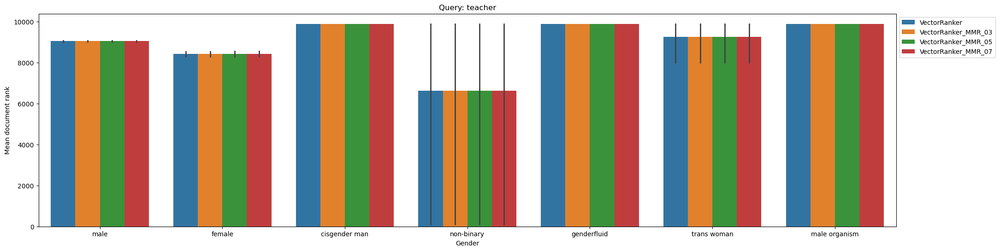
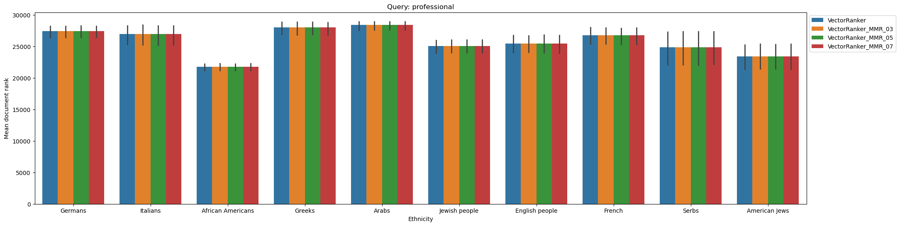
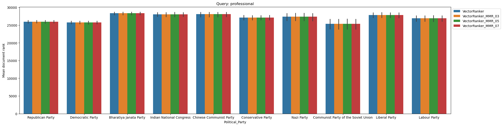

### SI 650 Homework 4
---
> Haoyang Ling (hyfrankl@umich.edu)

#### Problem 1
**Assumption** based on David's piazza post: for IR evaluation, anything not included in the 
 `n` documents ranked by a system is considered to have the rank `n + 1`
 (placed just after the least-relevant document).

##### Query 1: "person"
- **Ethnicity**:

- **Gender**:

- **Religious**:

- **Political**:

##### Query 2: "woman"
- **Ethnicity**:

- **Gender**:

- **Religious**:

- **Political**:

##### Query 3: "teacher"
- **Ethnicity**:

- **Gender**:

- **Religious**:

- **Political**:

##### Query 4: "role model"
- **Ethnicity**:

- **Gender**:

- **Religious**:

- **Political**:

##### Query 5: "professional"
- **Ethnicity**:

- **Gender**:

- **Religious**:

- **Political**:

##### Observations
I calculate the standard deviation of the group mean for each attribute and obtained the following table and observations.

- For query person, feedback will lead BM25 to larger disparity and VectorRanker to smaller disparity.
- For query woman, feeback will lead both BM25 and VectorRanker to larger disparity.
- For query teacher, feedback will lead BM25 to larger disparity in gender and political party and to smaller disparity in ethnicity and religious affliation. However, feedback will lead VectorRanker to smaller disparity.
- For query role model, feedback will lead BM25 to larger disparity in political party, ethnicity and religious affliation and to smaller disparity in gender. For query role model, feedback will lead VectorRanker to larger disparity in gender, ethnicity and religious affliation and to smaller disparity in political party.
- For query professional, feedback will lead BM25 to larger disparity in gender, political party, and religious affliation and to smaller disparity in ethnicity. However, feedback will lead VectorRanker to smaller disparity.
- Overall, we have observed that feedback have different impacts on different groups of people and queries. In general, VectorRanker performs better in reducing the disparity and bias.
- The pseudofeedback can help introduce more concepts in the feedback and make the results more diverse. However, it may also reinfoece some concepts if they frequently appear in the top documents retrieved by the base ranker like for the query "woman". We can see that BM25 uses the exact matches so that it has a strong power in influencing the concepts than VectorRanker that uses the latent space/vague match. In terms of fairness, we still need to think about the latent space/vector representation of VectorRanker. They may still contain some invisible bias.

<table border="1" class="dataframe">
  <thead>
    <tr style="text-align: right;">
      <th></th>
      <th>Ethnicity</th>
      <th>Gender</th>
      <th>Religious_Affiliation</th>
      <th>Political_Party</th>
    </tr>
  </thead>
  <tbody>
    <tr>
      <th>BM25_L2R_person</th>
      <td>1178.40</td>
      <td>6376.84</td>
      <td>455.21</td>
      <td>815.30</td>
    </tr>
    <tr>
      <th>BM25_L2R_Feedback_person</th>
      <td>1989.34</td>
      <td>9122.81</td>
      <td>1115.36</td>
      <td>1585.82</td>
    </tr>
    <tr>
      <th>VectorRanker_L2R_person</th>
      <td>2161.64</td>
      <td>7225.00</td>
      <td>1040.62</td>
      <td>1407.01</td>
    </tr>
    <tr>
      <th>VectorRanker_L2R_Feedback_person</th>
      <td>2152.87</td>
      <td>6955.02</td>
      <td>1015.32</td>
      <td>1384.10</td>
    </tr>
    <tr>
      <th>BM25_L2R_woman</th>
      <td>1676.67</td>
      <td>5784.38</td>
      <td>688.32</td>
      <td>1069.63</td>
    </tr>
    <tr>
      <th>BM25_L2R_Feedback_woman</th>
      <td>2118.18</td>
      <td>7046.77</td>
      <td>1225.71</td>
      <td>1531.90</td>
    </tr>
    <tr>
      <th>VectorRanker_L2R_woman</th>
      <td>1172.01</td>
      <td>7487.63</td>
      <td>778.07</td>
      <td>1157.58</td>
    </tr>
    <tr>
      <th>VectorRanker_L2R_Feedback_woman</th>
      <td>1182.53</td>
      <td>7523.28</td>
      <td>793.62</td>
      <td>1167.64</td>
    </tr>
    <tr>
      <th>BM25_L2R_teacher</th>
      <td>299.49</td>
      <td>482.09</td>
      <td>243.01</td>
      <td>273.03</td>
    </tr>
    <tr>
      <th>BM25_L2R_Feedback_teacher</th>
      <td>286.92</td>
      <td>916.21</td>
      <td>212.19</td>
      <td>352.95</td>
    </tr>
    <tr>
      <th>VectorRanker_L2R_teacher</th>
      <td>268.50</td>
      <td>1178.06</td>
      <td>247.13</td>
      <td>359.25</td>
    </tr>
    <tr>
      <th>VectorRanker_L2R_Feedback_teacher</th>
      <td>251.28</td>
      <td>1170.56</td>
      <td>237.26</td>
      <td>348.39</td>
    </tr>
    <tr>
      <th>BM25_L2R_role model</th>
      <td>5241.38</td>
      <td>23119.41</td>
      <td>2727.35</td>
      <td>2620.35</td>
    </tr>
    <tr>
      <th>BM25_L2R_Feedback_role model</th>
      <td>5988.04</td>
      <td>22695.15</td>
      <td>4794.07</td>
      <td>6537.22</td>
    </tr>
    <tr>
      <th>VectorRanker_L2R_role model</th>
      <td>7046.29</td>
      <td>27139.45</td>
      <td>5245.55</td>
      <td>6170.89</td>
    </tr>
    <tr>
      <th>VectorRanker_L2R_Feedback_role model</th>
      <td>7291.25</td>
      <td>27203.96</td>
      <td>5308.15</td>
      <td>6127.94</td>
    </tr>
    <tr>
      <th>BM25_L2R_professional</th>
      <td>2277.91</td>
      <td>1952.85</td>
      <td>511.87</td>
      <td>548.52</td>
    </tr>
    <tr>
      <th>BM25_L2R_Feedback_professional</th>
      <td>1728.07</td>
      <td>4319.37</td>
      <td>627.46</td>
      <td>1042.39</td>
    </tr>
    <tr>
      <th>VectorRanker_L2R_professional</th>
      <td>2107.59</td>
      <td>2064.92</td>
      <td>948.67</td>
      <td>1065.75</td>
    </tr>
    <tr>
      <th>VectorRanker_L2R_Feedback_professional</th>
      <td>2006.59</td>
      <td>1746.12</td>
      <td>919.00</td>
      <td>1054.69</td>
    </tr>
  </tbody>
</table>

#### Problem 2
**Observations**: the user 1 looks like an IT person or a programmer who often works with Linux and programming languages, whlie the user 2 looks like a biologist who searches for animals and climate changes.

<table border="1" class="dataframe">
  <thead>
    <tr style="text-align: right;">
      <th></th>
      <th>user1</th>
      <th>user2</th>
    </tr>
  </thead>
  <tbody>
    <tr>
      <th>0</th>
      <td>C (programming language)</td>
      <td>Sea otter</td>
    </tr>
    <tr>
      <th>1</th>
      <td>Object-oriented programming</td>
      <td>Snow leopard</td>
    </tr>
    <tr>
      <th>2</th>
      <td>Data type</td>
      <td>Giant otter</td>
    </tr>
    <tr>
      <th>3</th>
      <td>Class (computer programming)</td>
      <td>Veganism</td>
    </tr>
    <tr>
      <th>4</th>
      <td>Visual Studio Code</td>
      <td>Yosemite National Park</td>
    </tr>
    <tr>
      <th>5</th>
      <td>Stack (abstract data type)</td>
      <td>American bison</td>
    </tr>
    <tr>
      <th>6</th>
      <td>Emacs</td>
      <td>Deforestation and climate change</td>
    </tr>
    <tr>
      <th>7</th>
      <td>C standard library</td>
      <td>Overpopulation</td>
    </tr>
    <tr>
      <th>8</th>
      <td>CUDA</td>
      <td>Lemur</td>
    </tr>
    <tr>
      <th>9</th>
      <td>Open-source software development</td>
      <td>Zookeeper</td>
    </tr>
    <tr>
      <th>10</th>
      <td>Internet privacy</td>
      <td>Bornean orangutan</td>
    </tr>
    <tr>
      <th>11</th>
      <td>Wayback Machine</td>
      <td>Shedd Aquarium</td>
    </tr>
    <tr>
      <th>12</th>
      <td>Python (programming language)</td>
      <td>Wayback Machine</td>
    </tr>
    <tr>
      <th>13</th>
      <td>Computer science</td>
      <td>Animal</td>
    </tr>
    <tr>
      <th>14</th>
      <td>Java (programming language)</td>
      <td>Wikidata</td>
    </tr>
    <tr>
      <th>15</th>
      <td>Operating system</td>
      <td>Taxonomy (biology)</td>
    </tr>
    <tr>
      <th>16</th>
      <td>Programming language</td>
      <td>Wikispecies</td>
    </tr>
    <tr>
      <th>17</th>
      <td>Linux</td>
      <td>Eukaryote</td>
    </tr>
    <tr>
      <th>18</th>
      <td>JavaScript</td>
      <td>Mammal</td>
    </tr>
    <tr>
      <th>19</th>
      <td>C Sharp (programming language)</td>
      <td>Geographic coordinate system</td>
    </tr>
  </tbody>
</table>

#### Problem 3
Since I use the same trained model from Homework 3 and I don't train it again, it seems that the model pays no attention to the pagerank value changes. The personalization doesn't change any results.

So, I try to draw the tree of the LGBMRanker and observe that the threshold of pagerank is 0 so that it won't change the query results for me.

##### Python

<table border="1" class="dataframe">
  <thead>
    <tr style="text-align: right;">
      <th></th>
      <th>normal</th>
      <th>user_1</th>
      <th>user_2</th>
    </tr>
  </thead>
  <tbody>
    <tr>
      <th>0</th>
      <td>Monty Python</td>
      <td>Monty Python</td>
      <td>Monty Python</td>
    </tr>
    <tr>
      <th>1</th>
      <td>Python (programming language)</td>
      <td>Python (programming language)</td>
      <td>Python (programming language)</td>
    </tr>
    <tr>
      <th>2</th>
      <td>Monty Python's Life of Brian</td>
      <td>Monty Python's Life of Brian</td>
      <td>Monty Python's Life of Brian</td>
    </tr>
    <tr>
      <th>3</th>
      <td>Monty Python and the Holy Grail</td>
      <td>Monty Python and the Holy Grail</td>
      <td>Monty Python and the Holy Grail</td>
    </tr>
    <tr>
      <th>4</th>
      <td>Burmese python</td>
      <td>Burmese python</td>
      <td>Burmese python</td>
    </tr>
    <tr>
      <th>5</th>
      <td>Monty Python's Flying Circus</td>
      <td>Monty Python's Flying Circus</td>
      <td>Monty Python's Flying Circus</td>
    </tr>
    <tr>
      <th>6</th>
      <td>Python Software Foundation License</td>
      <td>Python Software Foundation License</td>
      <td>Python Software Foundation License</td>
    </tr>
    <tr>
      <th>7</th>
      <td>Python License</td>
      <td>Python License</td>
      <td>Python License</td>
    </tr>
    <tr>
      <th>8</th>
      <td>Mod python</td>
      <td>Mod python</td>
      <td>Mod python</td>
    </tr>
    <tr>
      <th>9</th>
      <td>CPython</td>
      <td>CPython</td>
      <td>CPython</td>
    </tr>
  </tbody>
</table>

##### java

<table border="1" class="dataframe">
  <thead>
    <tr style="text-align: right;">
      <th></th>
      <th>normal</th>
      <th>user_1</th>
      <th>user_2</th>
    </tr>
  </thead>
  <tbody>
    <tr>
      <th>0</th>
      <td>Java (software platform)</td>
      <td>Java (software platform)</td>
      <td>Java (software platform)</td>
    </tr>
    <tr>
      <th>1</th>
      <td>Java virtual machine</td>
      <td>Java virtual machine</td>
      <td>Java virtual machine</td>
    </tr>
    <tr>
      <th>2</th>
      <td>Java Platform, Standard Edition</td>
      <td>Java Platform, Standard Edition</td>
      <td>Java Platform, Standard Edition</td>
    </tr>
    <tr>
      <th>3</th>
      <td>Swing (Java)</td>
      <td>Swing (Java)</td>
      <td>Swing (Java)</td>
    </tr>
    <tr>
      <th>4</th>
      <td>Java (programming language)</td>
      <td>Java (programming language)</td>
      <td>Java (programming language)</td>
    </tr>
    <tr>
      <th>5</th>
      <td>Java</td>
      <td>Java</td>
      <td>Java</td>
    </tr>
    <tr>
      <th>6</th>
      <td>West Java</td>
      <td>West Java</td>
      <td>West Java</td>
    </tr>
    <tr>
      <th>7</th>
      <td>East Java</td>
      <td>East Java</td>
      <td>East Java</td>
    </tr>
    <tr>
      <th>8</th>
      <td>Central Java</td>
      <td>Central Java</td>
      <td>Central Java</td>
    </tr>
    <tr>
      <th>9</th>
      <td>Java Platform, Micro Edition</td>
      <td>Java Platform, Micro Edition</td>
      <td>Java Platform, Micro Edition</td>
    </tr>
  </tbody>
</table>

##### debug

<table border="1" class="dataframe">
  <thead>
    <tr style="text-align: right;">
      <th></th>
      <th>normal</th>
      <th>user_1</th>
      <th>user_2</th>
    </tr>
  </thead>
  <tbody>
    <tr>
      <th>0</th>
      <td>Android Debug Bridge</td>
      <td>Android Debug Bridge</td>
      <td>Android Debug Bridge</td>
    </tr>
    <tr>
      <th>1</th>
      <td>JTAG</td>
      <td>JTAG</td>
      <td>JTAG</td>
    </tr>
    <tr>
      <th>2</th>
      <td>Design for testing</td>
      <td>Design for testing</td>
      <td>Design for testing</td>
    </tr>
    <tr>
      <th>3</th>
      <td>Decompiler</td>
      <td>Decompiler</td>
      <td>Decompiler</td>
    </tr>
    <tr>
      <th>4</th>
      <td>Debugging</td>
      <td>Debugging</td>
      <td>Debugging</td>
    </tr>
    <tr>
      <th>5</th>
      <td>Web development tools</td>
      <td>Web development tools</td>
      <td>Web development tools</td>
    </tr>
    <tr>
      <th>6</th>
      <td>Android SDK</td>
      <td>Android SDK</td>
      <td>Android SDK</td>
    </tr>
    <tr>
      <th>7</th>
      <td>Write once, run anywhere</td>
      <td>Write once, run anywhere</td>
      <td>Write once, run anywhere</td>
    </tr>
    <tr>
      <th>8</th>
      <td>IEEE 802.1ag</td>
      <td>IEEE 802.1ag</td>
      <td>IEEE 802.1ag</td>
    </tr>
    <tr>
      <th>9</th>
      <td>Option type</td>
      <td>Option type</td>
      <td>Option type</td>
    </tr>
  </tbody>
</table>

#### Problem 4

##### Python

<table border="1" class="dataframe">
  <thead>
    <tr style="text-align: right;">
      <th></th>
      <th>normal</th>
      <th>normal_score</th>
      <th>user_1</th>
      <th>user_1_score</th>
      <th>user_2</th>
      <th>user_2_score</th>
      <th>query</th>
    </tr>
  </thead>
  <tbody>
    <tr>
      <th>0</th>
      <td>Python (programming language)</td>
      <td>11.348012</td>
      <td>Python (programming language)</td>
      <td>15.597758</td>
      <td>Python (programming language)</td>
      <td>4.184372</td>
      <td>python</td>
    </tr>
    <tr>
      <th>1</th>
      <td>CPython</td>
      <td>11.248195</td>
      <td>CPython</td>
      <td>15.460559</td>
      <td>CPython</td>
      <td>4.147566</td>
      <td>python</td>
    </tr>
    <tr>
      <th>2</th>
      <td>Python License</td>
      <td>11.171931</td>
      <td>Python License</td>
      <td>15.355736</td>
      <td>Python License</td>
      <td>4.119445</td>
      <td>python</td>
    </tr>
    <tr>
      <th>3</th>
      <td>Monty Python</td>
      <td>11.147250</td>
      <td>Monty Python</td>
      <td>15.321811</td>
      <td>Monty Python</td>
      <td>4.110344</td>
      <td>python</td>
    </tr>
    <tr>
      <th>4</th>
      <td>Pythonidae</td>
      <td>11.127032</td>
      <td>Pythonidae</td>
      <td>15.294023</td>
      <td>Pythonidae</td>
      <td>4.102890</td>
      <td>python</td>
    </tr>
    <tr>
      <th>5</th>
      <td>Jython</td>
      <td>11.105209</td>
      <td>Jython</td>
      <td>15.264027</td>
      <td>Jython</td>
      <td>4.094843</td>
      <td>python</td>
    </tr>
    <tr>
      <th>6</th>
      <td>Web Server Gateway Interface</td>
      <td>11.069681</td>
      <td>Web Server Gateway Interface</td>
      <td>15.215193</td>
      <td>Web Server Gateway Interface</td>
      <td>4.081742</td>
      <td>python</td>
    </tr>
    <tr>
      <th>7</th>
      <td>Python Software Foundation License</td>
      <td>11.069052</td>
      <td>Python Software Foundation License</td>
      <td>15.214330</td>
      <td>Python Software Foundation License</td>
      <td>4.081511</td>
      <td>python</td>
    </tr>
    <tr>
      <th>8</th>
      <td>PyPy</td>
      <td>11.061188</td>
      <td>PyPy</td>
      <td>15.203521</td>
      <td>PyPy</td>
      <td>4.078611</td>
      <td>python</td>
    </tr>
    <tr>
      <th>9</th>
      <td>Burmese python</td>
      <td>11.034089</td>
      <td>Burmese python</td>
      <td>15.166273</td>
      <td>Burmese python</td>
      <td>4.068619</td>
      <td>python</td>
    </tr>
  </tbody>
</table>

##### Java

<table border="1" class="dataframe">
  <thead>
    <tr style="text-align: right;">
      <th></th>
      <th>normal</th>
      <th>normal_score</th>
      <th>user_1</th>
      <th>user_1_score</th>
      <th>user_2</th>
      <th>user_2_score</th>
      <th>query</th>
    </tr>
  </thead>
  <tbody>
    <tr>
      <th>0</th>
      <td>Java Card</td>
      <td>9.922637</td>
      <td>Java Card</td>
      <td>14.171864</td>
      <td>Java Card</td>
      <td>2.743230</td>
      <td>java</td>
    </tr>
    <tr>
      <th>1</th>
      <td>Java (software platform)</td>
      <td>9.917421</td>
      <td>Java (software platform)</td>
      <td>14.164413</td>
      <td>Java (software platform)</td>
      <td>2.741788</td>
      <td>java</td>
    </tr>
    <tr>
      <th>2</th>
      <td>Java version history</td>
      <td>9.907955</td>
      <td>Java version history</td>
      <td>14.150894</td>
      <td>Java version history</td>
      <td>2.739171</td>
      <td>java</td>
    </tr>
    <tr>
      <th>3</th>
      <td>Java (programming language)</td>
      <td>9.898523</td>
      <td>Java (programming language)</td>
      <td>14.137423</td>
      <td>Java (programming language)</td>
      <td>2.736564</td>
      <td>java</td>
    </tr>
    <tr>
      <th>4</th>
      <td>Java</td>
      <td>9.869483</td>
      <td>Java</td>
      <td>14.095946</td>
      <td>Java</td>
      <td>2.728535</td>
      <td>java</td>
    </tr>
    <tr>
      <th>5</th>
      <td>Java Platform, Standard Edition</td>
      <td>9.835278</td>
      <td>Java Platform, Standard Edition</td>
      <td>14.047094</td>
      <td>Java Platform, Standard Edition</td>
      <td>2.719079</td>
      <td>java</td>
    </tr>
    <tr>
      <th>6</th>
      <td>East Java</td>
      <td>9.834396</td>
      <td>East Java</td>
      <td>14.045835</td>
      <td>East Java</td>
      <td>2.718835</td>
      <td>java</td>
    </tr>
    <tr>
      <th>7</th>
      <td>Java mouse-deer</td>
      <td>9.833757</td>
      <td>Java mouse-deer</td>
      <td>14.044921</td>
      <td>Java mouse-deer</td>
      <td>2.718658</td>
      <td>java</td>
    </tr>
    <tr>
      <th>8</th>
      <td>Java bytecode</td>
      <td>9.830178</td>
      <td>Java bytecode</td>
      <td>14.039810</td>
      <td>Java bytecode</td>
      <td>2.717669</td>
      <td>java</td>
    </tr>
    <tr>
      <th>9</th>
      <td>Free Java implementations</td>
      <td>9.825313</td>
      <td>Free Java implementations</td>
      <td>14.032862</td>
      <td>Free Java implementations</td>
      <td>2.716324</td>
      <td>java</td>
    </tr>
  </tbody>
</table>

##### Debug

<table border="1" class="dataframe">
  <thead>
    <tr style="text-align: right;">
      <th></th>
      <th>normal</th>
      <th>normal_score</th>
      <th>user_1</th>
      <th>user_1_score</th>
      <th>user_2</th>
      <th>user_2_score</th>
      <th>query</th>
    </tr>
  </thead>
  <tbody>
    <tr>
      <th>0</th>
      <td>JTAG</td>
      <td>15.128099</td>
      <td>JTAG</td>
      <td>12.381983</td>
      <td>JTAG</td>
      <td>8.273933</td>
      <td>debug</td>
    </tr>
    <tr>
      <th>1</th>
      <td>Design for testing</td>
      <td>13.608014</td>
      <td>Design for testing</td>
      <td>11.137830</td>
      <td>Design for testing</td>
      <td>7.442561</td>
      <td>debug</td>
    </tr>
    <tr>
      <th>2</th>
      <td>Android SDK</td>
      <td>13.107901</td>
      <td>Android SDK</td>
      <td>10.728500</td>
      <td>Android SDK</td>
      <td>7.169036</td>
      <td>debug</td>
    </tr>
    <tr>
      <th>3</th>
      <td>Debugging</td>
      <td>12.864538</td>
      <td>Debugging</td>
      <td>10.529313</td>
      <td>Debugging</td>
      <td>7.035935</td>
      <td>debug</td>
    </tr>
    <tr>
      <th>4</th>
      <td>Decompiler</td>
      <td>12.604760</td>
      <td>Decompiler</td>
      <td>10.316691</td>
      <td>Decompiler</td>
      <td>6.893856</td>
      <td>debug</td>
    </tr>
    <tr>
      <th>5</th>
      <td>Web development tools</td>
      <td>12.382309</td>
      <td>Web development tools</td>
      <td>10.134620</td>
      <td>Web development tools</td>
      <td>6.772192</td>
      <td>debug</td>
    </tr>
    <tr>
      <th>6</th>
      <td>USB-C</td>
      <td>12.330212</td>
      <td>USB-C</td>
      <td>10.091980</td>
      <td>USB-C</td>
      <td>6.743699</td>
      <td>debug</td>
    </tr>
    <tr>
      <th>7</th>
      <td>ARM architecture family</td>
      <td>12.321581</td>
      <td>ARM architecture family</td>
      <td>10.084916</td>
      <td>ARM architecture family</td>
      <td>6.738978</td>
      <td>debug</td>
    </tr>
    <tr>
      <th>8</th>
      <td>PlayStation models</td>
      <td>12.144339</td>
      <td>PlayStation models</td>
      <td>9.939847</td>
      <td>PlayStation models</td>
      <td>6.642040</td>
      <td>debug</td>
    </tr>
    <tr>
      <th>9</th>
      <td>Android Debug Bridge</td>
      <td>12.036886</td>
      <td>Android Debug Bridge</td>
      <td>9.851900</td>
      <td>Android Debug Bridge</td>
      <td>6.583272</td>
      <td>debug</td>
    </tr>
  </tbody>
</table>

##### Observations
- There are no changes between BM25 and PersonaliedBM25.
- They are similar to each other.
- The personalized part only affects the relative scores. User 1 like an IT person will have higher score for the queries like "python", "java", and "debug". User 2 like a biologist will have lower scores for these queries because the queries appear less frequently in the user's documents.
****

#### Problem 5

##### Observations:
Pseudofeedback doesn't necessarily improve performance. With different number of pseudofeedback documents, the best choice of alpha and beta will change. For my experiments:
- Best parameters (alpha and beta) for each num_docs:
  - When num_docs = 1, the best is alpha = 0.5 and beta = 0.5.
  - When num_docs = 5, the best is alpha = 0.9 and beta = 0.1.
  - When num_docs = 10, the best is alpha = 0.1 and beta = 0.9.
- Best parameter (num_docs) for alpha and beta:
  - For alpha = 0.5 and beta = 0.5, if we choose larger num_docs, we will get worse performance.
  - For alpha = 0.1 and beta = 0.9, if we choose larger num_docs, we will get better performance.
  - It seems that if we include more pseudofeedback documents, we would better put more weights (larger beta) on the pseudofeedback documents.
- Best and worse models:
  - The overall best one is num_docs = 1, alpha = 0.5, and beta = 0.5. But, it still performs worse than the non-pseudofeedback model -- hw2 model and generally better than hw3 model.
  - The worst model is num_docs = 10, alpha = 0.5, and beta = 0.5.
  - If let me choose one model with pseudofeedback, I will choose the parameters: num_docs = 1, alpha = 0.5, and beta = 0.5.
- Fairness:
  - I can't find clear relationship with fairness. But, q1 shows that the feedback can provide fairness for VectorRanker. So, when we have found that the model will obtain better fairness and performance as we include an optimal number of pseudofeedback documents. In terms of fairness, it would be better if we can improve more pseudofeedback documents, but we may have worse performance. So, there is always a trade-off.
