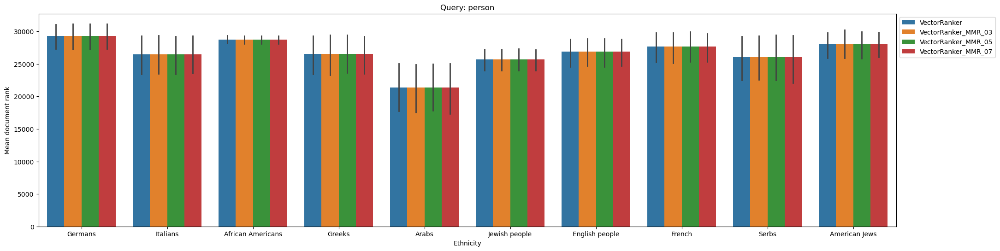
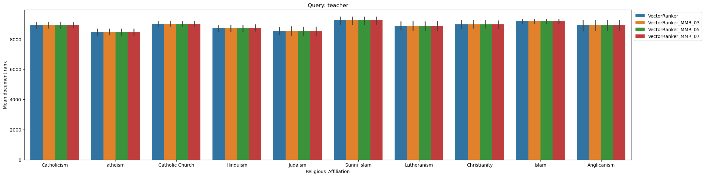
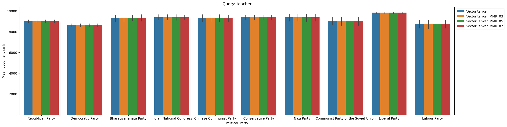
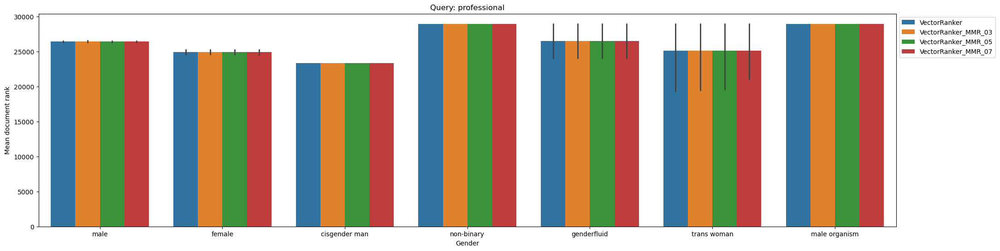
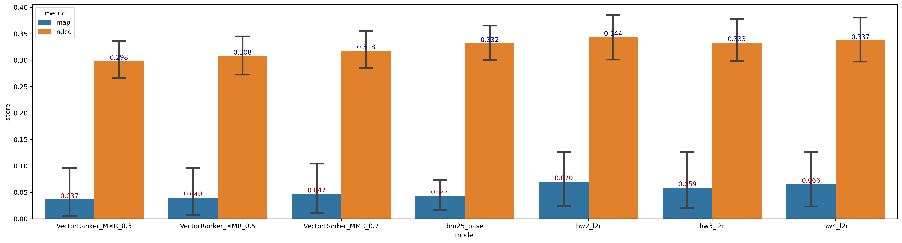

## SI 650 Homework 5
---
> Haoyang Ling (hyfrankl@umich.edu)


### Problem 1
see the code

### Problem 2
NFaiRR measures the fairness of the search engine results because the $\omega$ function helps calculate the fairness of the document by seeing how the document distribution deviates from the unbiased one, which may be based on the collection distribution. It uses the same strategy as NDCG to calculate the normalized weighted fairness to see the fairness of the ranker. Consider some situations:

1. if all the pages associated with one attribute are ranked at the top and the rest are ranked at the bottom (but still above the threshold) like (class 1, class 2, class 1), there is a clear bias in the result, but it won't be reflected if we only consider the average rank. It will result in a low NFaiRR because the top ranked result will have higher weight.
2. if no pages with attributes appear above the threshold, there won't be a bias in the case, and the NFaiRR value will be 1.

So, NFairRR actually prefers the ranker returns all the non-associated documents. Or we can say that it prefers the top ranked documents with large $\omega$ value. In general, it attempts to capture fairness by ensuring a diverse representation of different attributes throughout the ranking. However, if the distribution of the collections is biased, the NFaiRR will definitely score the ranker lower. Plus, 1 and 0 will only fit into the binary assumption. From the equation in the original paper, we can see that it only prefers non-associated paper and paper with equal mixture of the categories. So, it won't consider the case when ranker returns biased documents with unbiased ranks, for example, (class 1, class 2, class 2). It will give high score to (class 1, no class, class 1).

**Evaluation**: I test with 3 documents and 0, 1, 2 respectively indicate non-associated, class 1, and class 2 documents. 

```
(0, 0, 0) --> (1, 1, 1) -> 1.000
(0, 0, 1) --> (1, 1, 0) -> 1.000
(0, 0, 2) --> (1, 1, 0) -> 1.000
(0, 1, 1) --> (1, 0, 0) -> 1.000
(0, 1, 2) --> (1, 0, 0) -> 1.000
(0, 2, 1) --> (1, 0, 0) -> 1.000
(0, 2, 2) --> (1, 0, 0) -> 1.000
(1, 0, 1) --> (0, 1, 0) -> 1.000
(1, 0, 2) --> (0, 1, 0) -> 1.000
(2, 0, 1) --> (0, 1, 0) -> 1.000
(2, 0, 2) --> (0, 1, 0) -> 1.000
(0, 1, 0) --> (1, 0, 1) -> 0.815
(0, 2, 0) --> (1, 0, 1) -> 0.815
(1, 0, 0) --> (0, 1, 1) -> 0.815
(2, 0, 0) --> (0, 1, 1) -> 0.815
(1, 1, 0) --> (0, 0, 1) -> 0.631
(1, 2, 0) --> (0, 0, 1) -> 0.631
(2, 1, 0) --> (0, 0, 1) -> 0.631
(2, 2, 0) --> (0, 0, 1) -> 0.631
(1, 1, 1) --> (0, 0, 0) -> 0.000
(1, 1, 2) --> (0, 0, 0) -> 0.000
(1, 2, 1) --> (0, 0, 0) -> 0.000
(1, 2, 2) --> (0, 0, 0) -> 0.000
(2, 1, 1) --> (0, 0, 0) -> 0.000
(2, 1, 2) --> (0, 0, 0) -> 0.000
(2, 2, 1) --> (0, 0, 0) -> 0.000
(2, 2, 2) --> (0, 0, 0) -> 0.000
```

### Problem 3
1. For the collection-sensitive, I think we can divide the NFaiRR by the ranker-agnostic fairness of document sets proposed in the paper. It quantifies the collection fairness by considering possible ranking permutations.
2. As the metric consider the fairness document by summation first with category and then each document, the order makes the metric fails to capture the global fairness. Therefore, I would like to propose one metric that changes the summation order.
- **Metric**: evaluate the global fairness.
  $$
  Z = \sum_{i=1}^t p(i) \qquad \text{and} \qquad \sum_{a \in A} J_a = 1 \qquad \text{and} \qquad 
  mag^a(d) = \sum_{w \in V_a} \#<w, d> \qquad \\ 
  nmag^a(d) = \dfrac{mag^a(d)}{\sum_{x \in A} mag^x(d)} \quad \text{if} \quad \sum_{x \in A} mag^x(d) \geq r \quad \text{else} \quad J_a
  $$
  where $\#<w, d>$ denotes the number of word frequency $w$ in document $d$ and $V_a$ is a set of representative words of attribute $a$.
  $$
  \text{MyFaiRR}_q(L) = 1 - \frac{1}{Z'}\sum_{a \in A} \| - J_a + \frac{1}{Z}\sum_{i=1}^t p(i)\ nmag^a(d)\|,
  $$

  where $J_a$ can be a prior knowledge, for example, the expectation, and Z' is for normalization.

  **Reason**:
  The equation takes the summation of the fairness across the retrieved documents and evaluates how it deviates from the expected value $J_a$.

  **Verification**:
  $$
  \begin{aligned}
  \text{MyFaiRR}_q(L) &= 1 - \frac{1}{ZZ'} \sum_{a \in A} \| \sum_{i=1}^t p(i) (nmag^x(d) - J_a)\| \\
  &\geq 1 - \frac{1}{ZZ'} \sum_{a \in A} \sum_{i=1}^t p(i) \|nmag^a(d) - J_a\| \\
  &= \frac{1}{Z}\sum_{i=1}^t p(i) (1 - \frac{1}{Z'} \sum_{a \in A} \|nmag^a(d) - J_a\|)
  \end{aligned}
  $$

  **When Z' = 1**:
  $$
  \begin{aligned}
  \text{MyFaiRR}_q(L) &\geq \frac{1}{Z} \sum_{i=1}^t p(i) (1 - \sum_{a \in A} \|nmag^a(d) - J_a\|) \\
  &= \frac{1}{Z} \sum_{i=1}^t p(i) \omega(L^q_i) \\
  &= \frac{1}{Z} \text{FaiRR}_q(L) \\
  &\approx \text{NFaiRR}_q(L)
  \end{aligned}
  $$

  The above equation shows that when Z' = 1, it will be the (approximated) upper bound of the $\text{NFaiRR}_q(L)$.

  **When Z' = |A|/2**:
  $$
  \begin{aligned}
  \text{MyFaiRR}_q(L) &\geq \frac{1}{Z} \sum_{i=1}^t p(i) (1 - \frac{2}{|A|} \sum_{a \in A} \|nmag^a(d) - J_a\|) \\
  &= \frac{1}{Z|A|} \sum_{a \in A} \sum_{i=1}^t p(i) (1 - 2 \|nmag^a(d) - J_a\|) \\
  &= \frac{1}{Z|A|} \sum_{a \in A} \sum_{i=1}^t p(i) (1 - (\|nmag^a(d) - J_a\| + \|(1 - nmag^a(d)) - (1 - J_a)\|)) \\
  &= \frac{1}{Z|A|} \sum_{a \in A} \sum_{i=1}^t p(i) (1 - \sum_{x \in \{a, \neg a\}} \|nmag^x(d) - J_x\|) \\
  &= \frac{1}{Z}\mathrm{E}_{a \sim A} \left[\sum_{i=1}^t p(i) (1 - \sum_{x \in \{a, \neg a\}} \|nmag^x(d) - J_x\|)\right] \\
  &= \frac{1}{Z} \mathrm{E}_{a \sim A}\left[\sum_{i=1}^t p(i) \omega(L^q_i)\right] \\
  &= \mathrm{E}_{a \sim A}\left[ \frac{1}{Z} \text{FaiRR}_q(L)\right] \\
  &\approx \mathrm{E}_{a \sim A}\left[\text{NFaiRR}_q(L)\right]
  \end{aligned}
  $$

  Simultaneously, it also show that when Z' = |A|/2, it will be the (approximated) upper bound of the average normalized fairness $\text{NFaiRR}_q(L)$ if we treat the multiclass as a multi-binary problem with one-vs-rest strategy. 

  **Threshold t choosing**:
  For the threshold t, we can choose the smallest number of unbiased documents in the collection for each protected class so that $Z = \mathrm{IFaiRR}_{q}(\hat{S})$.

  With the same idea, we evaluate the ranker by taking the average of per-query scores.

  From the simulation, the metric can better evaluate fairness than the baseline.

  **Evaluation**:
  ```
  (0, 0, 0) --> 1.000
  (1, 2, 0) --> 1.000
  (2, 1, 0) --> 1.000
  (0, 1, 2) --> 0.860
  (0, 2, 1) --> 0.860
  (1, 0, 2) --> 0.860
  (2, 0, 1) --> 0.860
  (0, 0, 1) --> 0.760
  (0, 0, 2) --> 0.760
  (1, 2, 1) --> 0.760
  (1, 2, 2) --> 0.760
  (2, 1, 1) --> 0.760
  (2, 1, 2) --> 0.760
  (0, 1, 0) --> 0.620
  (0, 2, 0) --> 0.620
  (1, 0, 0) --> 0.620
  (2, 0, 0) --> 0.620
  (1, 1, 2) --> 0.480
  (2, 2, 1) --> 0.480
  (0, 1, 1) --> 0.380
  (0, 2, 2) --> 0.380
  (1, 0, 1) --> 0.380
  (2, 0, 2) --> 0.380
  (1, 1, 0) --> 0.240
  (2, 2, 0) --> 0.240
  (1, 1, 1) --> 0.000
  (2, 2, 2) --> 0.000
  ```

### Problem 4
see the code


### Problem 5

**Assumption**: for IR evaluation, anything not included in the 
 `n` documents ranked by a system is considered to have the rank `n + 1`
 (placed just after the least-relevant document).

##### Query 1: "person"
- **Ethnicity**:


- **Gender**:


- **Religious**:


- **Political**:


##### Query 2: "woman"
- **Ethnicity**:


- **Gender**:


- **Religious**:


- **Political**:


##### Query 3: "teacher"
- **Ethnicity**:


- **Gender**:


- **Religious**:


- **Political**:



##### Query 4: "role model"
- **Ethnicity**:


- **Gender**:


- **Religious**:


- **Political**:


##### Query 5: "professional"
- **Ethnicity**:


- **Gender**:


- **Religious**:


- **Political**:


##### NFaiRR


**Observation**
- From the figure, reordering almost changes nothing, so it doesn't help reduce disparity in the relative ranking. Also, it is reflected in the NFaiRR score.
- The vector of the top documents are likely to be similar without recenter the origin or using PCA. It would be hard to distinguish them with the MMR method. More advanced cluster-based diversification can be used here.

### Problem 6

With smaller lambda, more diversity is introduced to the ranker, but the performance becomes worse. We can see that with lambda 0.3 and 0.5, the ranker will perform worse than BM25. It shows the tradeoff between fairness and accuracy. For configuration, I would choose lambda 0.7 as the ranker that balances fairness and performance. Noticeably, hw2 and hw4 ranker are outstanding among these rankers.  